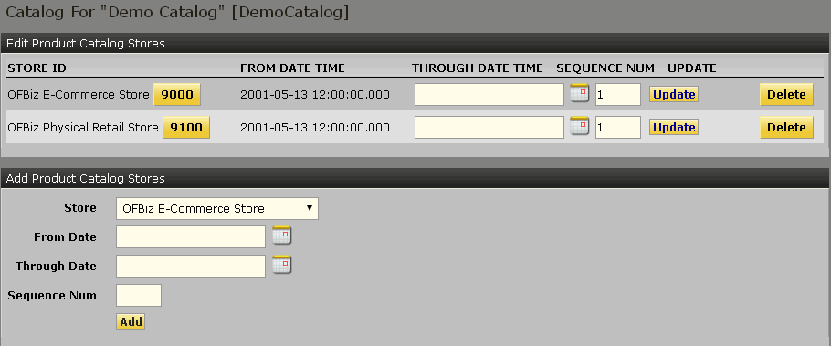

# OFBiz 目录管理应用程序 #
从这个应用程序，可以看到主要包括以下几部分主要业务。

## 1.1 主页

目录管理应用程序的主页面。
###  1.1.1 产品搜索框
#### 1.1.1.1简单搜索
选择关键词和产品分类进行产品检索。
检索以后右侧内容区显示产品查询结果清单。
#### 1.1.1.2 高级搜索
可以使用产品相关的大部分信息综合检索。
检索以后右侧内容区显示产品查询结果清单。
#### 1.1.1.3 快速功能跳转

可以按照选择的产品跳快速转到选择的功能操作页。
#### 1.1.1.4目录管理功能入口
##### 创建和编辑目录
##### 创建和编辑分类
##### 创建和编辑产品
##### 快速由变形产品创建虚拟产品
##### 自动为所有产品生成关键词
##### 快速重载目录信息到缓存
### 1.1.2 目录分类浏览树
点击目录，右侧内容区显示所选目录的编辑页。
点击分类，右侧内容区显示所选分类的编辑页。
### 1.1.3 分类下产品清单

点击目录分类浏览树中的分类的时候，此区域显示分类下的产品。

## 1.2 目录
### 1.2.1 目录管理
按照目录ID和目录名称查询目录清单。

### 1.2.2 创建目录

输入基本信息创建目录。
创建的目录，没有用分类进行填充，则不会在系统的目录分类树中显示出来。
### 1.2.3 修改目录
#### 1.2.3.1 目录基本信息编辑

#### 1.2.3.2 目录相关店铺管理

将目录指定给店铺，当目录建好后，如果没有关联到店铺的话，是不会在店铺的页面上显示这个目录的产品。因此建好目录后，需要将目录关联到店铺才有用。
##### 1.2.3.3 目录关联店铺清单
##### 1.2.3.4 删除店铺关联
##### 1.2.3.5 增加店铺关联
#### 1.2.4 目录相关人员管理

##### 1.2.4.1 目录人员清单
查看清单，编辑人员结束日期，删除人员。
##### 1.2.4.2 增加目录人员关联
选择人员，角色，起始日期，新建关联。
#### 1.2.5 目录相关分类管理

##### 1.2.5.1 目录分类清单
##### 1.2.5.2 删除分类关联
##### 1.2.5.3 增加分类关联

## 1.3 分类
### 1.3.1 分类管理
按照分类ID和分类名称查询分类清单。

### 1.3.2 创建分类
输入基本信息创建分类。

### 1.3.3 修改分类
#### 1.3.3.1 基本信息修改

##### 基本信息
##### 图片信息
##### 产品分类复制
#### 1.3.3.2 分类关联内容管理

##### 关联内容清单
##### 添加产品类别内容
选择内容ID，开始日期
##### 添加关联内容
##### 简单字段域值覆盖
#### 1.3.3.3 分类层级管理

##### 上层分级管理
##### 上层分级添加
##### 下层分级管理
##### 下层分级添加
#### 1.3.3.4 分类相关产品管理

##### 1.3.3.4.1 分类产品激活或失效
##### 1.3.3.4.2 添加分类产品
选择产品，设置起始日期，添加备注，即可添加产品到本分类。
##### 1.3.3.4.3 复制分类下产品到另一个分类
选择目标分类；
可选过滤时间条件；
选择是否包含子分类（默认不包含）；
##### 1.3.3.4.4 过期分类下全部产品
可选：到期日期
##### 1.3.3.4.5 删除分类下全部过期产品
可选：在某日期前过期
#### 1.3.3.5 分类产品目录管理

##### 分类产品目录清单
这个分类所管理的所有目录的清单
##### 编辑分类产品目录
设置失效日期
##### 删除分类产品目录
删除分类关联关系
##### 添加分类产品目录
设置目录，目录类型，起始时间（可选）
#### 1.3.3.6 分类特征管理

##### 将产品特产附加为分类特征
##### 分类特征清单
##### 从其他分类复制分类特征
##### 直接添加分类特性
#### 1.3.3.7 分类相关人员管理

##### 分类人员清单
查看清单，编辑人员结束日期，删除人员。
##### 增加分类人员关联
选择人员，角色，起始日期，新建关联。
#### 1.3.3.8 分类属性管理

##### 分类属性清单
可以查看属性清单，修改属性值，删除属性。
##### 分类属性添加
输入属性名称，属性值，可以增加此属性到本分类。

## 1.4 产品

## 1.5 特征

## 1.6 促销

## 1.7 价格规则

## 1.8 店铺

## 1.9 产品店铺组

## 1.10 辞典

## 1.11 评价

## 1.12 配置

## 1.13 订阅

## 1.14 送货

## 1.15 图片管理

